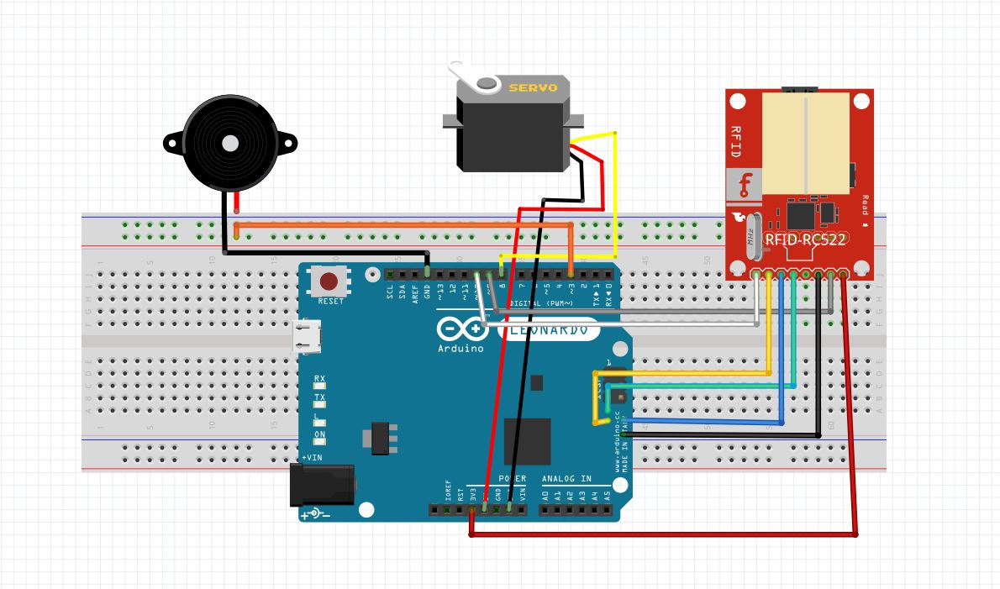

# RFID_LOCK
My first project witch arduino from my university if technology.  These were practical classes on microcontrollers. Was very fun. In home I do document box with lock.
I had no idea about programing. Code C++ from Internet was sort of magical spell to me, but when I looked at it longer, I understood almost everything and I could add more from myself. So, it's easy but is sentimental (very good vibes).

##Connecions

